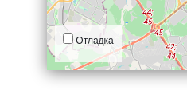

# Куда пойти — Москва глазами Артёма

Фронтенд для будущего сайта о самых интересных местах в Москве. Авторский проект Артёма.


[Демка сайта](https://devmanorg.github.io/where-to-go-frontend/).

## Как запустить

- Скачайте код
- Перейдите в каталог проекта с файлом `index.html`
- Запустите веб-сервер
- Откройте в браузере

В качестве веб-сервера можно использовать что угодно. Например, подойдёт даже самый простой встроенный в Python веб-сервер:

```sh
$ python -m http.server 8000
```

## Настройки

Внизу справа на странице можно включить отладочный режим логгирования.



Настройки сохраняются в Local Storage браузера и не пропадают после обновления страницы. Чтобы сбросить настройки удалите ключи из Local Storage с помощью Chrome Dev Tools —> Вкладка Application —> Local Storage.

Если что-то работает не так, как ожидалось, то начните с включения отладочного режима логгирования.

## Формат данных

Фронтенд ожидает получить от сервера JSON сообщение со списком точек на карте:

```js
{
    // TODO ...
}
```

## Используемые библиотеки

- [Leaflet](https://leafletjs.com/) — отрисовка карты
- [loglevel](https://www.npmjs.com/package/loglevel) для логгирования
- [Bootstrap](https://getbootstrap.com/) — CSS библиотека
- [Vue.js](https://ru.vuejs.org/) — реактивные шаблоны на фронтенде

## Цели проекта

Код написан в учебных целях — это урок в курсе по Python и веб-разработке на сайте [Devman](https://dvmn.org).

Тестовые данные взяты с сайта [KudaGo](https://kudago.com).
